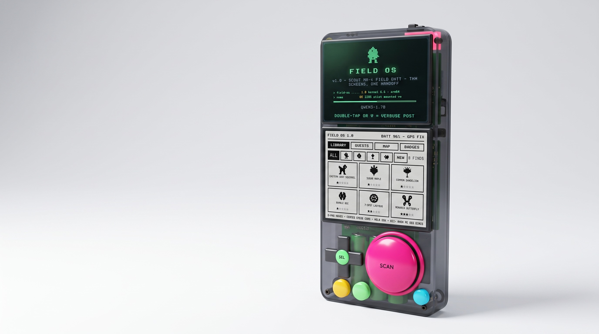
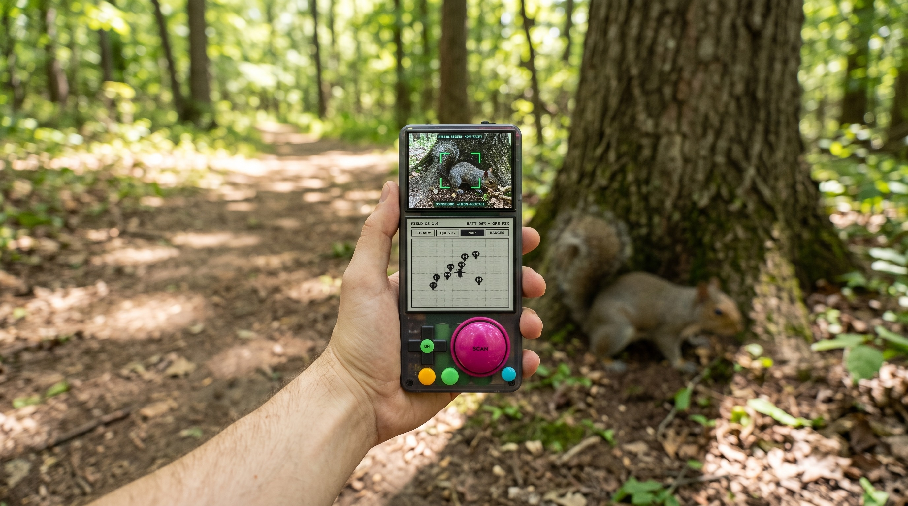
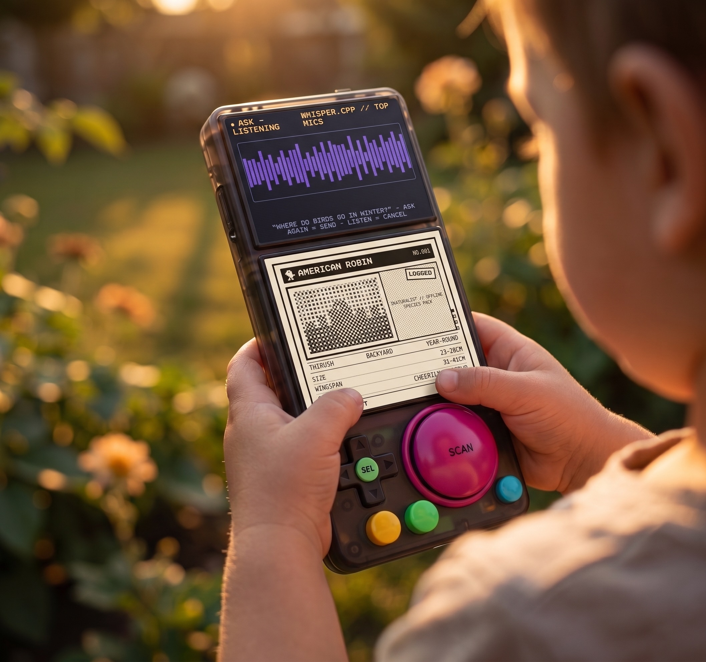
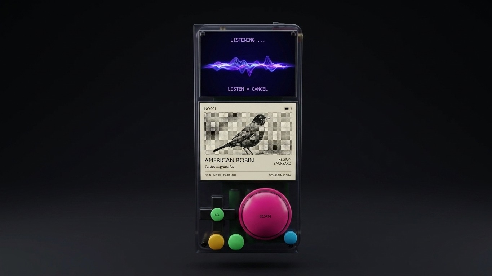
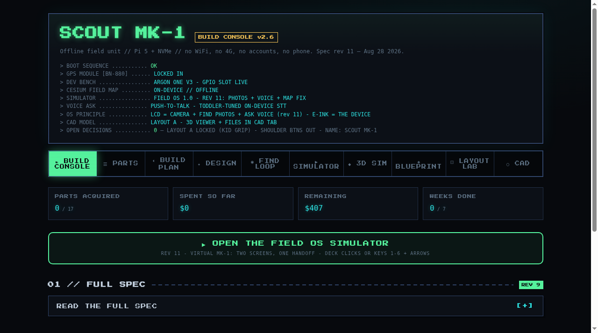
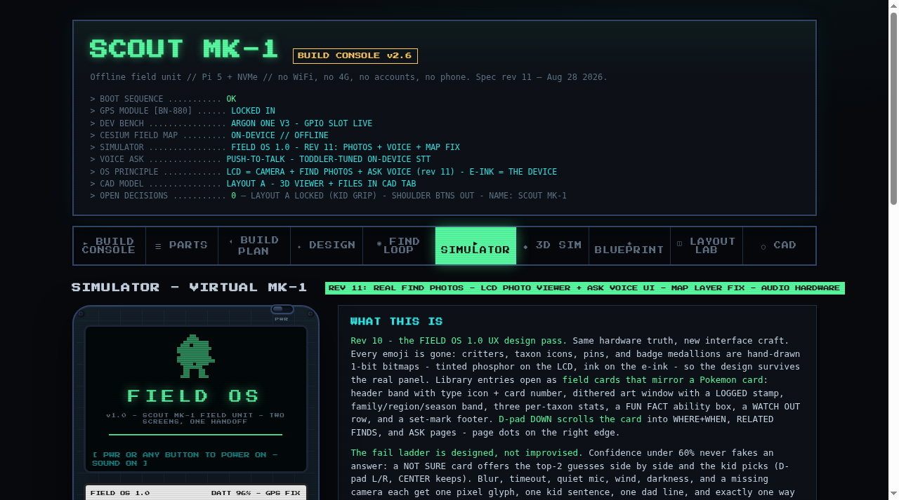
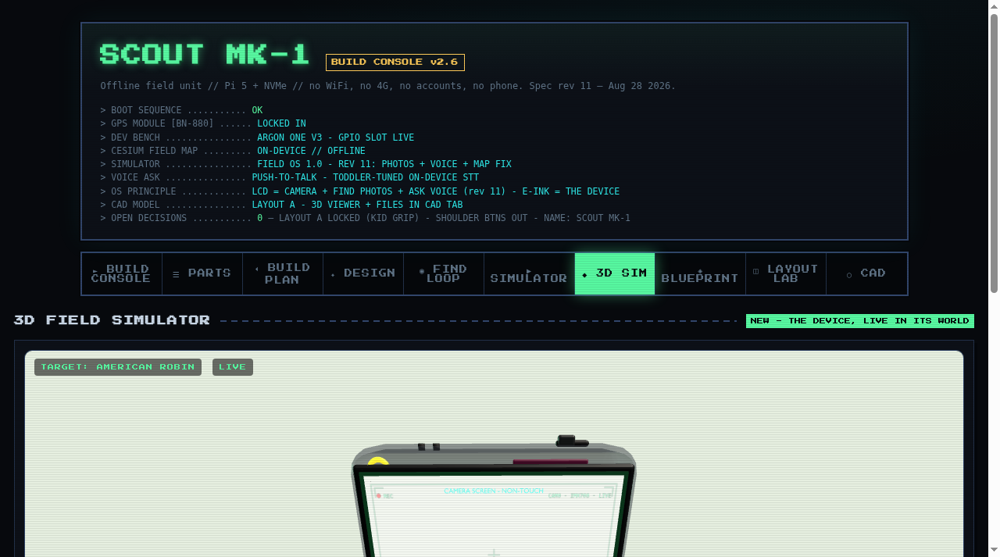
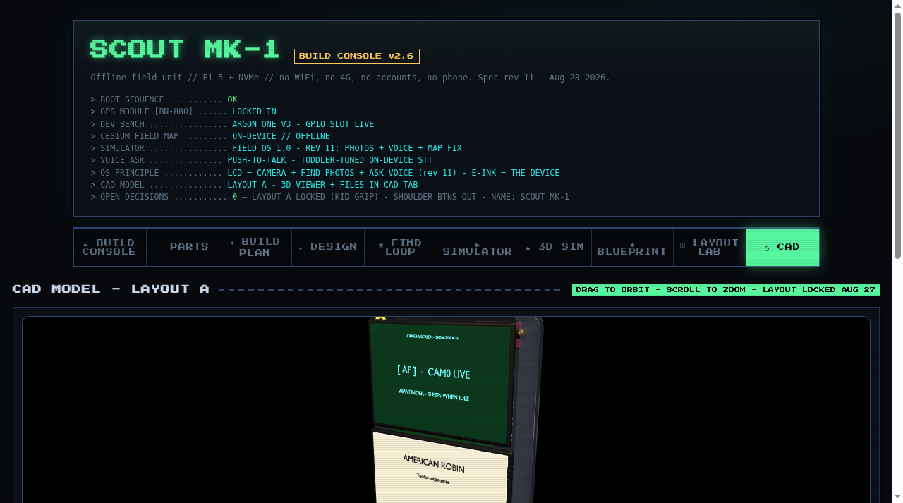

# SCOUT MK-1 // FIELD OS

A real-world Pokedex: a fully offline handheld nature scanner built for a 3-year-old (and a first hardware build for his dad). Point it at a plant, bug, bird, or animal and it identifies it on-device. Listen to birdsong and it names the bird. Ask it questions about what you just found. Every "Find" gets pinned on an offline CesiumJS map. No cloud, no account, no subscription.

**Try the simulator + build console live:** https://jastman.github.io/Scout-Pokedex-Field-OS/ - a single self-contained page holding the FIELD OS simulator, the interactive 3D sim, the CAD viewer, the parts checklist with buy links, the 7-week build plan, per-step newbie guides, and copy-ready LLM prompts.

## The device

## In the field

## Inside the build console

## Repo layout

- `index.html` - SCOUT Build Console (FIELD OS simulator, interactive 3D field sim with mobile touch controls + fullscreen, CAD viewer, build plan). Deck layout: rev 20, locked final Aug 29. Served at the Pages root.
- `status.json` - the build-status strip in the console header reads this file (with an embedded fallback), so editing it here updates the public dashboard: current week, state, progress %, one-line detail.
- `field_os/` - the actual FIELD OS device software: package skeleton (`src/fieldos/`), architecture doc, and the rev 24 hard rules. Target: Raspberry Pi OS Lite (64-bit, Trixie) on the Pi 5 bench.
- `docs/field-os-design-doc.md` - FIELD OS 1.0 UX design system (rev 11): one job per screen, tokens, screen specs.
- `docs/hardware-architecture.md` - storage/accelerator decision, corrected mass/power/cost budgets, bus + pin map, CAD fit-check (Sep 1 architecture review).
- `docs/software-architecture.md` - AI pipeline concurrency/scheduling plan and the ASK latency budget; bench gates live in `field_os/tests/bench/`.
- `docs/scout-mk1-winning-prompts.md` - the exact prompts behind the marketing render set above.
- `cad/` - the Blender sources: both .blend files, the .glb, and the parametric build script - byte-identical to what the console ships.
- `assets/` - marketing renders and console screenshots.

## Hardware (spec)

Raspberry Pi 5 + NVMe, 5" color touch LCD (viewfinder) + 5.83" B/W e-ink (card/library), dual mics, Beitian BN-880 GPS, 4x 21700 cells, 3D-printed translucent smoked-PETG shell, 60mm SCAN dome. BOM ~$375. Software: iNaturalist vision model, BirdNET, small local LLM, offline CesiumJS tiles.

Built in public. Named SCOUT MK-1, running FIELD OS. Saved items are "Finds."
